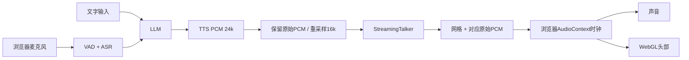

# VoxaStage

本地优先的实时语音数字人，支持 2D / 3D 形象与可切换语音后端。

一个可打断的本地语音数字人：Qwen ASR → Qwen LLM → Index-TTS → StreamingTalker
增量网格或 DINet / FlashHead 肖像帧 → 浏览器 WebAudio + WebGL / Canvas2D。支持麦克风与文字，声音和嘴型共用播放时钟。
当前驱动范围为 **DINet 2D、FlashHead Lite 2D、StreamingTalker 3D**。对话后端可独立选择级联 ASR → Qwen → IndexTTS，或 MiniCPM-o 端到端语音；后者已完成真实模型部署、语音与多轮测试，以及三种数字人组合的打断恢复验证。当前机器已启用 MiniCPM 选项；新部署需配置模型服务地址。MindTalker 作为 MiniCPM 接入参考。见 [MiniCPM 接入与限制](omni-server/README.md) 和 [DINet 接入说明](docs/DINET-DEPLOYMENT.md)。
最新进展与明确缺口见 [多驱动验收记录](AVATAR-MULTIDRIVER-RESULTS.md)，桥接格式见 [协议](AVATAR-PROTOCOL.md)，FlashHead 部署见 [worker 说明](video-server/README.md)。

## 当前机器直接体验

打开现有 Pipecat 地址的 **`/avatar`**，例如
<http://127.0.0.1:18314/avatar>。点击「连接会话」，输入「介绍一下语音 agent 技术」，
或点击「开启麦克风」。连接前可选择已配置的驱动。点击「打断」立即停止旧声音和动画队列，恢复待机循环并保留对话文字；再次开口也可由
VAD 自动打断。纯语音 WebRTC 页面仍是 `/`。两种入口共享一个会话名额，测试前先断开另一页面。

在当前工程中 `python3 ctl.py stop` / `python3 ctl.py start` 管理 Pipecat，保留模型进程。
数字人本机地址保存在被忽略的 `runtime/avatar-config.json`（`{"url":"ws://.../v1/stream"}`），
`PIPECAT_AVATAR_URL` 优先级更高。该配置不进入发布包。

2D 服务准备好后设置 `PIPECAT_FLASHHEAD_URL=ws://127.0.0.1:8203/v1/stream`。
DINet 设置 `PIPECAT_DINET_URL=ws://127.0.0.1:19003/api/ws/live_video/<character_id>`，使用既有服务的原生音频接口。角色资源须由部署者提供；不随本源码包分发。FlashHead 继续使用 `/v1/stream` 桥接协议。
`PIPECAT_AVATAR_PROVIDER` 可更改默认驱动。也支持以下本地配置，修改后重启 Pipecat：

```json
{
  "default_provider": "streamingtalker",
  "providers": {
    "streamingtalker": {"url": "ws://127.0.0.1:12544/v1/stream"},
    "flashhead": {"url": ""},
    "dinet": {"url": "ws://127.0.0.1:19003/api/ws/live_video/<character_id>"}
  }
}
```

空地址表示未配置；配置地址并不代表模型已加载或健康。用户界面不会展示内部服务地址。

## 在另一台机器启动

这是**模型服务之上的集成 demo**。先准备下表中四个兼容后端；安装 Python demo 本身不会下载、
启动全部模型，也不能把任意 兼容云端 API 直接填入这些自定义协议地址。
本次验证使用同机 RTX 4090 和已驻留的模型，尚未完成空白 GPU 机器的全量安装验收。

1. 安装 Python 3.11、`uv`、Node 18+（仅测试需要），以及系统音频依赖。
2. 解压源码包，在目录中执行 `bash install_demo.sh`。仅创建本目录 `.venv`，按锁文件安装
   Pipecat 1.10.0 和依赖，下载并校验 NLTK 分句资源。
3. `cp .env.example .env`，填写已启动的模型服务与有权使用的音色 ID。
4. 启动：

```bash
set -a
source .env
set +a
mkdir -p runtime/numba-cache
.venv/bin/python bot.py --host 127.0.0.1 --port 18314 -t webrtc
```

浏览器打开 `/avatar`。远程机器可用 SSH 将 18314 转发到本地，通过 localhost 访问，
以满足浏览器麦克风安全上下文要求；此版没有公网认证与多租户隔离。

| 配置 | 必须实现的协议 |
| --- | --- |
| `PIPECAT_ASR_URL` | `GET /health` 返回 `ready`；`POST /transcribe` 接收16k单声道PCM16 WAV，返回 `{"text":"..."}`。包内 `asr_server.py` 可作参考，模型运行环境单独准备。 |
| `PIPECAT_LLM_URL` | `GET /health`；`POST /generate` 接收 `messages,max_new_tokens`，返回逐行JSON增量 `{"text":"..."}`，错误用 `{"error":"..."}`。 |
| `PIPECAT_TTS_URL` | `POST /api/tts/list` 返回 `speaker_ids`；`/ws/tts` 接收 `open_stream,is_start,text,is_end` 四条JSON，返回24k PCM16二进制及终止 `is_end`。完整字段见 `backend.py`。 |
| `PIPECAT_AVATAR_URL` | StreamingTalker 扩展 `/v1/stream`，接收16k PCM16，输出30fps拓扑、网格和完成事件。安装与固定上游版本见 [avatar-server/README.md](avatar-server/README.md)。官方项目原版并不自带本扩展API。 |

数字人音频使用流式24k→16k重采样，模型输出每帧搭配**原始24k TTS PCM**；最后不足一个
视频帧的音频保留、维持最后嘴型。模型使用200ms块和200ms前视，并非零前视因果模型。

## 哪些来自框架，哪些是本项目

- Pipecat 提供处理器管线、VAD、话轮控制、WebRTC/WebSocket传输和上下文聚合。
- 本项目提供本地 ASR/LLM/TTS 适配、混合语言配置、等待尾段转写的话轮策略与日志；
  新增数字人流适配、同代音画配对、浏览器播放、打断隔离、单会话准入和回归测试。
- StreamingTalker 模型来自上游；`avatar-server` 是固定上游版本上的本地增量服务扩展。
  网格由模型生成，前端不使用预录嘴型，也不是按音量开合的假动画。



浏览器预缓冲约120ms，最多提前安排350ms音频；声音源和网格都绑定 AudioContext 时间。
每次打断递增 generation，浏览器停止已安排的音频、清空网格，双方丢弃旧代媒体。
后端推理取消是合作式；新任务等待旧任务清理，忙时重试有上限。播放 started/ended
回执驱动 Pipecat 说话状态，TTS 生成结束不再冒充浏览器播放结束。

## 验证

```bash
.venv/bin/python -m unittest test_backend test_services test_asr_server test_turns \
  test_avatar_backend test_avatar_session test_tts_lifecycle \
  test_dialogue_backends test_omni_backend test_omni_processor test_omni_route
(cd omni-server && ../.venv/bin/python -m unittest test_worker)
node --test avatar-web/tests/*.test.mjs
# 真实模型：文字回答、打断并恢复
.venv/bin/python smoke_avatar.py --interrupt
# 自备有权使用的16k、单声道PCM16 WAV；再次发送该语音，验证VAD自动打断
.venv/bin/python smoke_avatar.py --input /path/to/test.wav --interrupt
```

[AVATAR-RESULTS.md](AVATAR-RESULTS.md) 记录实测口径。浏览器测试接口
`window.avatarDemo.metrics` 包含 generation、播放状态、排队音频、已安排声音源、
渲染帧数；这些指标不等同物理扬声器与摄像头测量。

## 边界

- 单用户，本地/可信网络演示；与纯语音入口共享模型资源，每会话上限10分钟。
- 长回复会自动拆分，每个数字人clip最多30秒；服务端音频待发队列上限30秒、8个clip；浏览器最多900帧/30秒。
  超限或后端失败会停止会话，界面提示重新连接。
- 使用WebSocket传输PCM和base64网格，5023顶点×30fps约2.4MB/s网格数据（未计JSON/拓扑），
  不适合直接当作公网低带宽视频方案。WebRTC视频编码可作为后续版本。
- 窗口后台节流、模型欠载会产生停顿；播放器跳过过期网格，声音与嘴型仍采用同一时钟。
- 麦克风启用浏览器AEC/降噪，必要时线性降采样到16k；物理设备的回声、串音和主观音质仍需实际试听。
- 级联后端 assistant 上下文按生成文字提交，打断后可能保留未听完的答案。MiniCPM 分支仅在浏览器完整播放回执后保留回答文字；被打断时保留用户输入和中断标记，不保留未确认完整播放的回答。均不提供逐词听取记录。
- 模型原生3D头部没有真人纹理，不能代表写实数字人的视觉质量。
- 日志包含识别文本和模型回答，不保存麦克风原始PCM。分享日志前检查其内容。

## 开源发布

`python3 export_demo.py` 生成 `dist/voxastage-source.tar.gz` 与SHA256文件清单。
该脚本采用源码白名单，排除 `.env`、本机配置、模型权重、日志、音色、人物模板、输入录音
和测试生成媒体。发布包的操作入口为本README，不依赖原工程的绝对路径。

集成层和前端使用 [MIT](LICENSE)；数字人服务目录保留其自身许可和归属。
模型权重、VOCASET/FLAME模板、音色及其他数据的许可分别处理，不因集成代码开源而获得
再分发授权。源码与模型、音色和人物素材分开管理；压缩包可供代码审查与独立部署。

## 角色音色与体验升级

三种驱动提供固定男女声映射、无声idle视频循环，以及可选的ASR/LLM兼容API。
本地质量对照、部署限制及配置见 [体验升级说明](docs/EXPERIENCE-UPGRADE.md)。
运行时音视频、模型权重和密钥不在源码包内；首次部署必须配置参考音色与idle素材。
