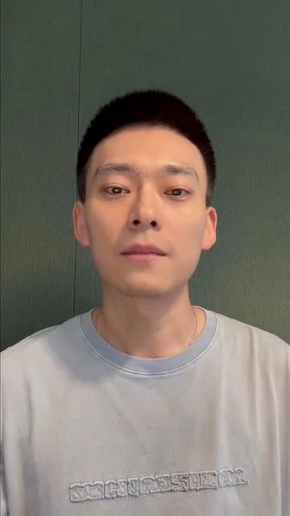
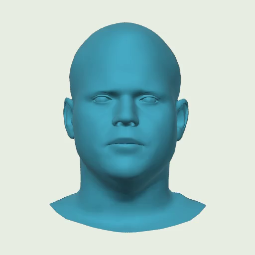
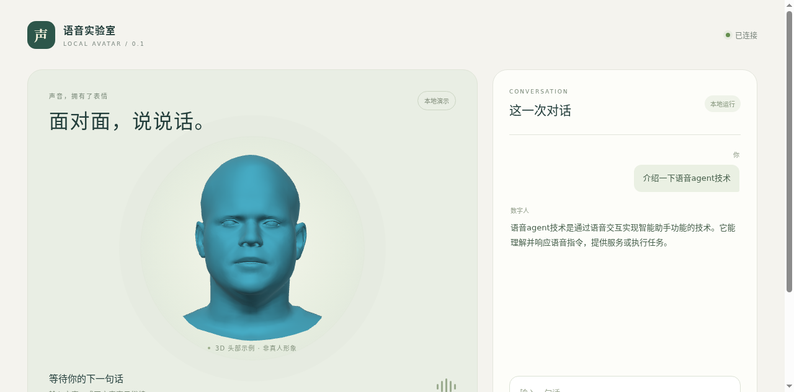
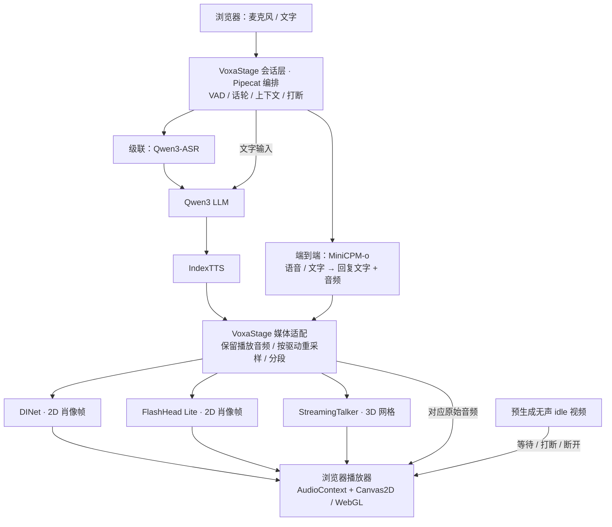

# VoxaStage

**让语音对话拥有一个可打断、会回应的 2D / 3D 数字人。**

VoxaStage 是基于 **Pipecat** 的本地优先语音数字人集成项目：把语音模型、数字人模型和浏览器交互连接起来，支持 **级联语音 / MiniCPM-o 端到端语音**两条对话链路，以及 **DINet / FlashHead / StreamingTalker** 三种形象驱动。对话后端与形象可以独立选择。

[效果预览](#效果预览) · [系统架构](#系统架构) · [来源与贡献](#来源与贡献) · [启动体验](#启动体验) · [验证与边界](#验证与边界)

## 效果预览

| DINet · 2D 男生 | FlashHead Lite · 2D 女生 | StreamingTalker · 3D 头部 |
| :---: | :---: | :---: |
|  |  |  |
| 男声 · 肖像帧 | 女声 · 肖像帧 | 男声 · 动态网格 |

以上为当前部署中三个角色的**真实待机输出截帧**。对话时由对应模型生成嘴型与表情；等待、打断和通话结束后播放预先生成的无声 idle 循环。截图用于展示集成效果，不代表本项目训练了这些模型，也不包含人物素材的再使用授权。



*早期本地联调界面实拍，页眉沿用当时的“语音实验室”；仓库中的界面现已更名为 VoxaStage。静态截图展示布局和模型输出，音画同步、打断及 idle 切换需要运行 demo 体验。*

## 能做什么

- **两条语音链路**：ASR → LLM → TTS 可单独替换组件；MiniCPM-o 直接处理语音并生成回复文字和声音。
- **三种形象驱动**：DINet 和 FlashHead 输出 2D 视频帧，StreamingTalker 输出 3D 网格，统一在浏览器播放。
- **可打断对话**：支持文字与麦克风；手动打断或 VAD 检测到新话轮后停止旧播放、清空队列，并丢弃迟到媒体。
- **音画对齐**：回复音频与对应画面共用浏览器播放时钟；长回复连续分段，并限制队列与预送量。
- **角色与待机**：男、女角色分别映射参考音色；等待和断开后继续播放同角色 idle 视频，无需持续模型推理。
- **本地优先，可选云端**：默认连接本地模型服务；提供显式启用的 ASR / LLM 兼容 API 适配，密钥留在服务端。

这是模型服务之上的工程集成 demo。基础模型能力来自下列上游项目；真实工具调用、慢任务管理和用户中途改目标仍属于后续工作。

## 系统架构



**Pipecat 是编排框架，级联与端到端是对话后端的选择。** 接入 Pipecat 不会把级联模型变成端到端模型。当前 MiniCPM-o 分支按 VAD 切分用户话轮，不等同于模型原生全双工。

两条语音链路与三种形象驱动的组合均完成过真实模型联调和打断恢复检查；详见[多驱动验收](AVATAR-MULTIDRIVER-RESULTS.md)与 [MiniCPM 验证](docs/MINICPM-RESULTS.md)。

## 来源与贡献

| 组成 | 上游项目 / 作者 | 上游提供 | VoxaStage 的接入与扩展 |
| --- | --- | --- | --- |
| 实时会话框架 | [Pipecat](https://github.com/pipecat-ai/pipecat) · Daily / 社区 | 处理器管线、VAD 集成、话轮与上下文机制、实时传输 | 本地服务适配、话轮策略、独立后端选择、共享会话准入 |
| 语音识别 | [Qwen3-ASR](https://github.com/QwenLM/Qwen3-ASR) · Qwen 团队 | 语音转文字模型 | 本地 ASR 服务、术语上下文配置、识别质量对照 |
| 文本大模型 | [Qwen3](https://github.com/QwenLM/Qwen3) · Qwen 团队 | 文本理解与生成模型 | 流式服务适配、语音回复提示、项目事实背景 |
| 语音合成 | [IndexTTS](https://github.com/index-tts/index-tts) · IndexTTS 团队 | 文本到语音、参考音色能力 | 对接既有 TTS 服务、角色音色映射与固定音色兼容修复；完整 TTS 服务另行部署 |
| 端到端语音 | [MiniCPM-o](https://github.com/OpenBMB/MiniCPM-o) · OpenBMB | 直接理解语音并生成语音的模型 | 独立 worker、话轮接入、音色条件与播放确认；参考本人此前 MindTalker 项目的 MiniCPM 接入经验 |
| 2D 驱动 | [DINet](https://github.com/MRzzm/DINet) · 论文作者 | 音频驱动的人脸视频生成 | 连接既有部署服务的音频 WebSocket；该服务协议不是官方 DINet 标准 API |
| 2D 驱动 | [SoulX-FlashHead](https://github.com/Soul-AILab/SoulX-FlashHead) · Soul AI Lab | FlashHead Lite 肖像视频生成 | 流式桥接 worker、音视频配对、单 GPU 兼容补丁 |
| 3D 驱动 | [StreamingTalker](https://github.com/zju3dv/StreamingTalker) · ZJU3DV | 音频驱动的三维人脸生成 | 固定上游版本上的增量服务、WebSocket 协议、无头运行补丁、浏览器网格渲染 |

**本项目主要实现的是集成与交互层**：后端与形象解耦、媒体协议、连续重采样、音画调度、打断隔离、取消清理、背压、idle 生命周期，以及相应回归测试。没有重新训练上述基础模型；数字人的神经网络、训练方法和基础生成质量不归为本项目原创。

来源、固定版本、补丁范围和许可说明见 [THIRD_PARTY.md](THIRD_PARTY.md)。StreamingTalker 使用的历史代码版本保留 Apache-2.0 许可；上游后续已调整许可，**不能将当前上游或模型权重统一视为 Apache-2.0**。准确版本和原文见 [NOTICE](avatar-server/NOTICE.md)。

## 启动体验

需要 Python 3.11、`uv`，以及已部署的模型服务。安装本项目不会自动下载所有权重；GPU、显存和环境要求请分别查看各 worker 文档。目前尚未验收空白机器的一键完整部署。

```bash
bash install_demo.sh
cp .env.example .env
# 编辑 .env：填写后端地址、已注册音色，以及需要启用的数字人 / MiniCPM 服务。
set -a
source .env
set +a
mkdir -p runtime/numba-cache
.venv/bin/python bot.py --host 127.0.0.1 --port 18314 -t webrtc
```

打开 **<http://127.0.0.1:18314/avatar>**，选择对话后端和形象，点击「连接会话」，再输入文字或开启麦克风。可用“介绍一下语音 agent 技术”体验中英混合输入；回答期间再次开口或点击「打断」，断开后查看 idle 循环。

远程运行时将端口通过 SSH 转发到 localhost，以满足浏览器麦克风安全上下文要求。纯语音入口为 `/`，与数字人入口共享单个会话名额。

| 要配置的能力 | 部署入口 |
| --- | --- |
| 本地 ASR / LLM / TTS 与环境变量 | [部署与协议](docs/DEPLOYMENT.md)、[环境变量示例](.env.example) |
| StreamingTalker 3D worker | [avatar-server/README.md](avatar-server/README.md) |
| FlashHead Lite 2D worker | [video-server/README.md](video-server/README.md) |
| 既有 DINet 服务 | [DINet 接入](docs/DINET-DEPLOYMENT.md) |
| MiniCPM-o 端到端 worker | [omni-server/README.md](omni-server/README.md) |
| 男女声、idle 素材、可选云端接口 | [体验配置](docs/EXPERIENCE-UPGRADE.md)、[TTS 音色兼容](tts-compat/README.md) |

参考音色、人物模板、权重和 idle 视频由部署者自行准备。仓库中的静态展示截图不作为运行素材。

## 验证与边界

新增[数字人适配层基线工具](docs/AVATAR-EVALUATION.md)：统一输入哈希、重复运行、失败计数、PCM与时间戳检查。完整质量与端到端评测按[阶段路线](docs/plans/2026-09-19-roadmap.md)逐步补齐。

已有验收包括真实模型回复、三种驱动的打断恢复、男女声路由和 idle 切换；自动化回归覆盖 **65 项应用 Python 测试、6 项 MiniCPM worker 测试、16 项前端测试**。测试命令：

```bash
.venv/bin/python -m unittest discover -s . -p 'test_*.py'
.venv/bin/python -m unittest discover -s omni-server -p 'test_*.py'
node --test avatar-web/tests/*.test.mjs
# 已部署真实模型后：
.venv/bin/python smoke_avatar.py --interrupt
# 语音输入：16kHz、单声道 PCM16 WAV
.venv/bin/python smoke_avatar.py --input /path/to/test.wav --interrupt
```

Node 18+ 仅用于前端测试。完整口径见[首轮验收](AVATAR-RESULTS.md)、[多驱动验收](AVATAR-MULTIDRIVER-RESULTS.md)与[体验升级记录](docs/EXPERIENCE-UPGRADE.md)。

| 当前边界 | 说明 |
| --- | --- |
| ASR 与回答质量 | 当前本地 ASR 已验证 1.7B，示例环境仍以 0.6B 为起点；术语样本改善不等于真实麦克风整体错误率下降。默认 LLM 为 Qwen3-4B，尚未证明通用能力升级。 |
| 云端接入 | 已有协议适配和模拟 HTTP 测试，尚未进行真实云端 API 联调。 |
| 运行范围 | 本地 / 可信网络单用户 demo，每会话最多 10 分钟；无公网认证和多租户隔离。 |
| 连续播放 | 长回复以最多 30 秒的 clip 连续分段；有界队列和预送机制不能消除模型欠载、浏览器后台节流产生的停顿。 |
| 打断后上下文 | 级联可能保留未听完的已生成文字；MiniCPM 依赖完整播放回执保留回答。均无逐词已听内容对齐。 |
| 画面与带宽 | 3D 头部无真人纹理；当前 PCM / 网格 / 帧经 WebSocket 传输，尚未做面向公网的低带宽视频方案。 |
| 实际听感 | 浏览器启用回声消除与降噪；物理麦克风回声、音色匹配和长期对话仍需实机试听。 |

后续重点：更可靠的混合语言识别与回答质量评测、真实工具调用和慢任务状态、改目标后的任务取消、逐词播放确认，以及更易复现的部署与传输优化。

## 许可与源码导出

VoxaStage 集成层和前端使用 [MIT License](LICENSE)。第三方代码保留各自许可和声明；模型权重、FLAME / VOCASET 等数据、人物与音色资源分别遵循其来源许可，集成层的 MIT 许可不授予这些资源的再分发权。详见 [第三方来源与许可](THIRD_PARTY.md)。

```bash
python3 export_demo.py
```

生成 `dist/voxastage-source.tar.gz` 和 SHA256 文件清单。导出内容为源码、文档和本页列出的静态展示截图；排除密钥、机器配置、模型权重、日志、输入录音及运行时音视频。
