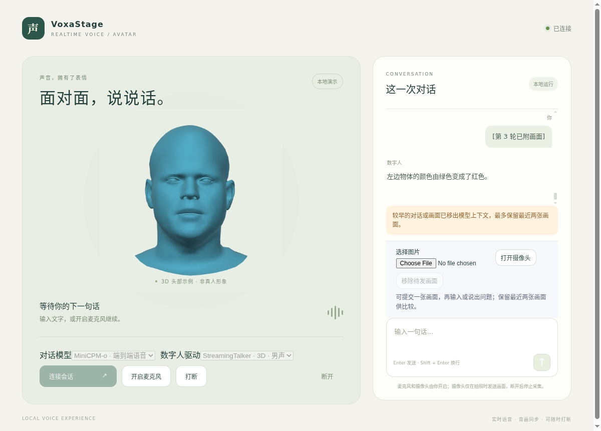

# 真实视觉与语音基线

2026-09-19，固定MiniCPM-o-4.5-AWQ快照，真实完成图文、图音、前后画面比较，以及DINet、FlashHead、StreamingTalker浏览器交互。输入只有两张合成几何图和一句合成语音，是能力与失败探针，不是通用准确率数据集。视觉理解来自上游模型；本项目实现输入绑定、历史裁剪、评测和媒体集成。

截图展示真实模型回复与历史裁剪提示，截取时已恢复idle；静态截图不能证明动态口型质量。

## 模型与实验口径

- 固定模型快照：`a3073852f52e4beec3f278d1f6616d40c26fe343`；显式启用视觉编码器，仍为VAD分轮。
- 场景A：左红色圆形、右蓝色方形；场景B只把左侧改成绿色。定向问题为“请说出图中左边物体的颜色和形状。”
- 问题语音为合成素材，未经过人工听写确认。模型输出文本按构造参考检查，未进行真人听感或口型标注。
- 先做6次能力探针，包含1次文本预热、图文、图音、两帧比较、仅语音和通用图片描述。随后独立执行1次预热及32次正式请求：2个case×4条件×4轮，确定性轮换顺序，不随机化。
- 正式单轮请求无历史借用。采样保持模型原有随机生成，未固定随机种子。仅语音的8次是同一句语音的重复，不是8条不同问题。

## 观察结果

| 输入条件 | 正式协议通过 | 输出文字复核 |
| --- | --- | --- |
| 仅语音，没有图片 | 8/8 | 8次都无依据描述颜色/形状，包含红、蓝、黄及圆形、方形、圆柱等猜测 |
| 图片与通用描述要求 | 8/8 | 8次颜色与形状描述符合构造参考；未要求回答定向问题，不按定向问答计分 |
| 图片与文字问题 | 8/8 | 8次左侧颜色、形状符合构造参考 |
| 图片与原始语音问题 | 8/8 | 8次左侧颜色、形状符合构造参考 |

前后画面探针回答：“与上一张相比，左边物体的颜色从红色变成了绿色。”

上述是辅助检查者对返回文字和合成图片的逐条复核，来源在机器记录中标为assistant inspection；不能冒充人工听感评分。通用描述中有一次只列出两个物体而未明确左右，颜色/形状符合不代表空间描述完备。原评测工具的语义评分字段仍为空，派生复核与原始协议结果分开保存。

正式请求的客户端首音频到达中位数为0.859–0.914秒，整轮完成中位数1.039–1.695秒。这些计时包含HTTP流缓冲和传输，不是GPU纯推理、浏览器出声或物理端到端延迟。整卡显存总量24564MiB，视觉加载后使用17883MiB；首次6探针后使用18977MiB，包含驻留ASR，不能作为单模型峰值。

[模型与32次正式对照记录](benchmarks/2026-09-19-real-multimodal.json)保留输入、请求、响应、源码摘要和完整失败范围。

## 三种数字人的浏览器验证

每个驱动连续三轮：上传红圆图并文字提问；上传绿圆图并从浏览器按20ms节奏发送合成PCM，经真实VAD绑定图音；再次上传红圆图比较前后变化，同时裁剪第一张图。

| 驱动 | 真实请求 | 本轮展示帧数 | 音色路由 |
| --- | --- | --- | --- |
| DINet | 3 | 341 | male |
| FlashHead | 3 | 239 | female |
| StreamingTalker | 3 | 428 | male |

三驱动均获得真实文字、音频和媒体输出；第三轮模型请求只保留最近两图，最早图片明确标记不可见。回复结束及断开后idle恢复，服务端会话释放。此处音色只验证实际传入模型的选择，未以自动化记录代替听感匹配。

测试使用真实应用路由、模型客户端和数字人后端；客户端观测包装仅记录摘要并原样转发。图片由真实上传控件缩放为JPEG，语音从浏览器WebSocket注入，未使用物理麦克风。浏览器为headless Chrome及软件WebGL。[三驱动9轮记录](benchmarks/2026-09-19-real-visual-browser.json)包含图片来源/时间/摘要、历史结构、回复和播放计数。

追加三驱动各一次真实播放中手动打断及换图恢复：共6个模型请求。打断后旧音源数量和待播帧均为0，700ms观察期间旧画面计数不再增长；新请求保留上轮被打断标记，并依据绿色新图正确回复，随后播放完成并释放会话。[打断记录](benchmarks/2026-09-19-real-visual-interruption.json)与顺序流程分开保存。这是按钮打断，不是物理麦克风打断；模型文字可能早于播放完成，不能据此声称每次都中止了GPU计算。

## 失败、恢复与下一阶段

第一次视觉加载成功，但候选端口被现有编辑器进程占用，模型未进入推理。保留失败后更换空闲端口，并在任何原服务切换前检查端口；没有停止占用者。每次实验使用独立目录和到期恢复守护，结束后核验原语音服务健康、进程身份、候选及守护退出。默认部署仍保持原语音模型。

后续方法实验聚焦已重复观察到的“缺少图片仍给出视觉断言”：比较原提示、通用缺图约束及明确视觉证据状态，同时保留有图问答和普通非视觉问题作为对照，检查是否只是扩大拒答。该[三策略消融](VISUAL-GROUNDING-ABLATION.md)随后已完成：本探针通用规则与显式数量均减少无图断言，未观察到显式数量的额外收益。动态口型质量、真人听写/试听及物理设备声学计时仍为独立待办。
