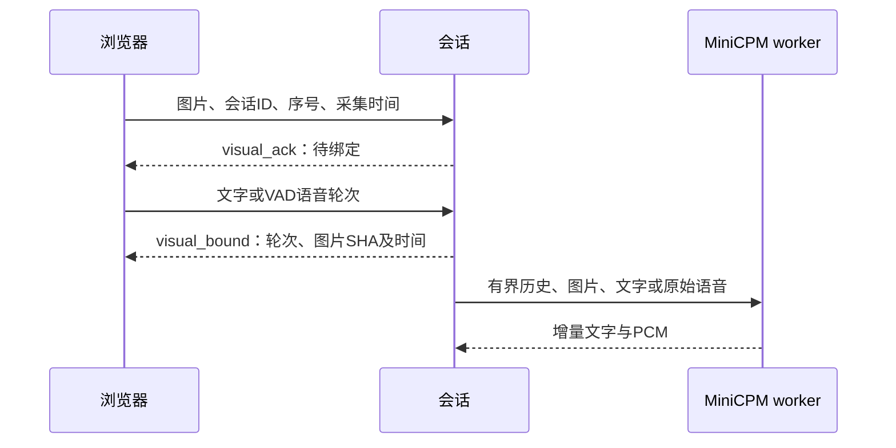

# 按需画面与语音交互

当前为本地实现与流程验证阶段，真实视觉模型推理、三种数字人组合及语义准确率对照尚未验收。现有默认语音服务没有启用此功能。图片理解来自 MiniCPM-o，本项目贡献是能力探测、画面与轮次绑定、有界历史及交互清理，不是新的视觉模型。

## 使用流程

视觉 worker 启动时显式添加 `--vision`，加载视觉编码器；`GET /health` 的 `capabilities.image_input` 才返回 true。应用在连接时重新检查实际能力，支持时显示画面面板。未启用的 worker 对图片请求明确报错，避免把“没看图”伪装成识图失败。

```bash
python omni-server/worker.py --model /path/to/pinned-model-snapshot \
  --port 18201 --vision \
  --male-reference /path/to/male.wav --female-reference /path/to/female.wav
```

模型环境和固定版本见 [MiniCPM 部署](../omni-server/README.md)。视觉会增加显存与预填充计算，尚未测量当前部署的实际增量；不要仅依据上述命令认为模型已加载成功。

连接 MiniCPM 对话后，可以选择一张 JPEG/PNG，或主动打开摄像头并点击拍照。文件选择上限 8MiB，浏览器缩放到最长边 512 像素并编码 JPEG。摄像头只在拍照时发送静态画面，不连续上传视频。上传时间表示文件被选中的时刻，不是图片原始拍摄时间。

等待“画面已确认”后输入问题或说话。附件只绑定下一条文字或下一轮 VAD 完成的语音，后来的图片不会改变已启动的请求。回答后可以提交第二张图并询问前后变化；最多保留两张最近画面。移除按钮只移除尚未绑定的附件，不删除已经进入历史的图片。断开会话停止摄像头并清空历史；迟到的文件解码或摄像头授权结果不能进入新会话。

## 时间、序号与上下文

每张图片携带会话 ID、递增序号、图片 ID、来源及 `captured_at_ms`。客户端时间以本次连接为起点，范围 0–600000ms，与现有每会话最多 600 秒一致。服务另记相对接收时间及图片 SHA；两种时钟未做偏移标定，不能据此宣称物理音画同步。



旧会话、重复/倒退序号、坏图片与越界值明确拒绝，拒绝不替换先前已确认的附件。新输入得到递增 `turn_id`；模型历史仍遵循六轮、60秒语音及12000字符限制。第三张图进入时先移除最早图像数据，保留对应问答，并注明该轮图片已经不可见。未完整播放的回答不会作为已完成回答写入历史。

语音按原来的 1 秒块送入模型，图像和元数据只出现在第一块，避免重复编码图片。默认仍为 VAD 分轮，不宣称模型原生全双工或连续视频理解。

## 协议边界

浏览器控件消息：

```json
{"type":"visual","session_id":"会话返回的ID","sequence":1,"operation":"set","image":{"id":"image-1","source":"upload","captured_at_ms":1200,"data":"JPEG或PNG的base64"}}
```

清除待发图使用同类消息、新序号和 `operation:"clear"`。服务返回 `visual_ack` 或非致命的 `visual_error`。`visual_bound` 记录本轮绑定的图片元数据，无原图数据。普通控制消息仍限制 4096 字符，视觉消息最多 360000 字符。

worker 的每条 user 消息可增加 `images` 列表。整次请求最多两张图，每张最多 256KiB、1024×1024，只接受非动画 JPEG/PNG，ID 唯一且为字母、数字、下划线或连字符。user 的 `text` 与 `audio` 仍二选一；助手消息不得附图。HTTP 请求体最多 4MB，语音/文字/图片各自上限同时生效。客户端声明不能替代服务端验证。

## 检查与未完成项

```bash
.venv/bin/python -m unittest test_visual_context test_visual_route test_omni_backend test_omni_processor test_avatar_session test_omni_route
.venv/bin/python -m unittest discover -s omni-server -p 'test_*.py'
node --test avatar-web/tests/*.test.mjs
```

本地测试覆盖附图与原PCM绑定、裁剪、关闭期间异步绑定、晚到结果、摄像头授权和解码后的资源清理。模型响应替身用于检查会话协议，不用于识图准确率结论。部署仍需真实固定模型的图文、图音、两帧变化测试，再完成语音单模态、图像通用询问和联合输入对照；原始输入哈希、逐次输出和失败必须保留。

路线及各项验收见[实施计划](plans/2026-09-19-visual-interaction.md)。人工口型质量、物理设备声学标定和后续针对性方法实验仍为独立待办。

## 2026-09-19 本地验收记录

27项应用相关Python检查、11项worker检查、33项前端检查通过。独立Chrome复用真实页面和WebSocket会话，模型与数字人媒体由替身提供；三轮完成上传、虚拟摄像头快照、第三图移除最早图像、待发图清除，断开后摄像头轨道停止、服务端会话释放。页面布局曾把摄像头开启后的输入区挤出对话框，两次提交等待失败保留；调整视觉面板尺寸与对话列表最小高度后完整流程通过。

[机器记录](benchmarks/2026-09-19-visual-ui.json)保留实际图片来源/时间/哈希、三轮模型请求结构、源码摘要和失败记录。虚拟摄像头及模拟回复不验证真实摄像头采集质量、模型识图、口型或端到端延迟。当前实现尚未部署到默认演示服务；下一项门槛是真实视觉模型及图音联合推理。
